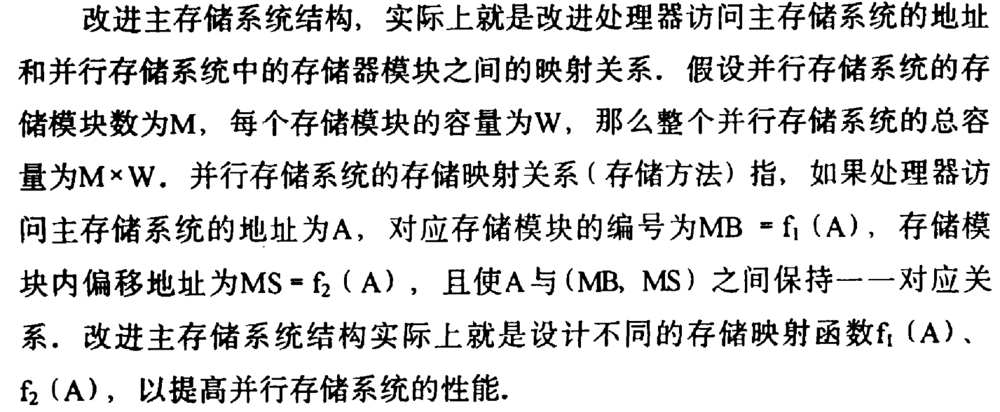
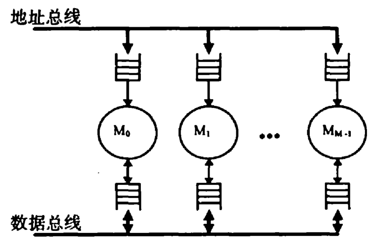
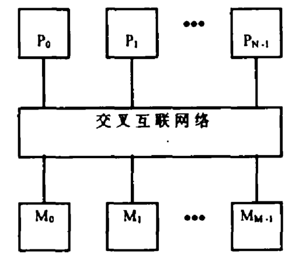
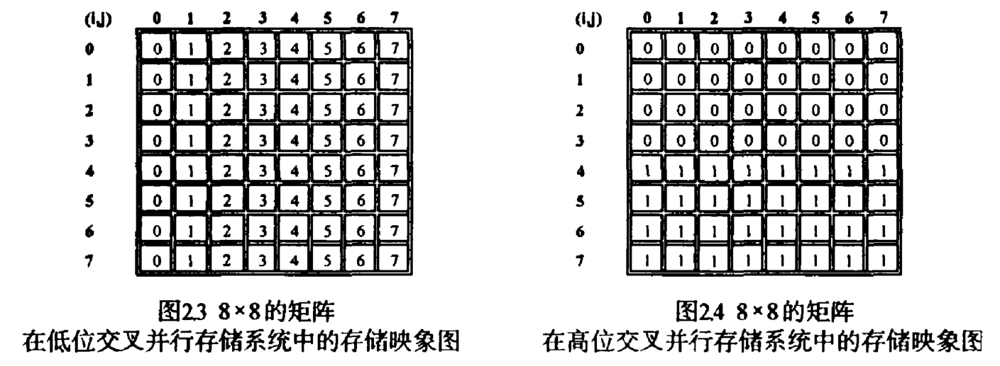

# 摘要

处理器的存取访问在并行存储系统中和高速缓存系统中存在存储体冲突和高速缓存行冲突，而在进一步的研究中发现，并行存储系统和层次存储系统中的存储映射方法对它们的存储性能有很大的影响。

# 引言

处理器体系结构技术：超标量体系结构、流水线体系结构、超长指令字技术、精简指令集

针对主存储器存取速度无法满足处理器存储速度要求的问题，**并行存储系统结构**和**层次存储系统结构**技术被相应提出。

- **并行存储系统结构**
- **层次存储系统结构** —— 局部性原理
  - 高速缓存系统 -> 一级、二级 ...

当在并行存储系统中出现**存储体冲突**或层次存储系统中出现**高速缓存行冲突**即不命中时，处理器所要等待的时间会比传统的主存储系统的存取时间更长。

# 并行存储技术回顾

并行存储系统中，存储系统由N个可并行存取的存储模块组成，由此增加整个主存储系统的存取带宽。

理想情况下，如果处理器对主存储系统的访问始终均匀地分布在所有N个主存储模块中，那么整个存储系统的存取带宽就是单个存储模块的N倍。

然而实际系统中，处理器访问主存储系统的操作不能均匀分布在这N个并行存储模块中，即出现存储访问中的模块冲突（体冲突）：

- **体冲突**：在一个存储模块尚未完成前一个存储访问的情况下，处理器又向它发出一个存储访问周期，这时此存储模块就不能立即响应该存储访问周期，所以处理器就不得不插入等待周期或终止当前存储访问周期。

存储体冲突的改进方法：

- 改进程序结构，从而改变处理器访问主存储系统的地址序列；（×）

  - 程序维护成本较高、可移植性较差；
  - 具体问题求解过程中，访问主存储系统的地址序列是固定的；

- 改进主存储系统的结构，使程序访问主存储系统的地址序列在主存模块间均匀分布；

  - 即改进处理器访问主存储系统的地址和并行存储系统中的存储器模块之间的映射关系

    

## 并行存储系统模型

### 流水线访问的并行存储系统模型

处理器的地址序列按其存储访问次序出现在地址总线，依据并行存储系统的地址映射关系去访问各存储模块。在各并行存储模块中设计有一定数量的地址缓冲器和数据缓冲器。如果存储访问地址对应的存储模块的地址缓冲器有空闲单元，那么该地址就可以被缓存，从而释放地址总线，允许处理器发出下一个存储访问地址；如果当前存储器访问周期的地址对应的存储模块没有空闲的地址缓冲器单元，那么处理器就必须插入等待周期，直到该存储模块的地址缓冲器有空闲单元时才能结束本次存储访问，开始后续存储访问周期。存储模块的输出按其地址输入的次序存放在数据输出缓冲器中。整个并行存储系统有一个输出数据序列控制单元，它可以保证数据按其对应地址出现在地址总线上的次序出现在数据总线上。

在每个存储系统中增加地址缓冲单元和数据输出缓冲单元，可以增加并行存储系统允许每个存储模块内同时出现的最大存储体冲突个数，从而减少由于存储体冲突造成的总线等待周期数，提高整个并行存储系统的性能。

### 并行访问的并行存储系统模型

并行访问的并行存储系统，广泛适用于共享存储的多处理器并行计算机系统。每一个处理器都可以通过互联网络访问任何一个主存储模块，常用的互联网络有交换网络(Crossbar)、超立方(Hypercube)、二维网咯(2-D Mesh)、二叉树(Binary Tree)等。

假设只要各处理器访问的存储单元不在同一个存储模块中，互联网络都能为它们提供互不交叉的存储访问链路，实现各处理器在主存储系统中的并行存取，那么要发挥每一个并行处理器的最大潜能的唯一条件就是使程序分配在各处理器中的存取操作在主存储系统中不存在存储体冲突。假设各处理器要分别访问矩阵列的不同元素，如果该矩阵列的元素分别存储在不同的存储模块中，那么各处理器就可以通过互联网络同时存取所需要的数据；反之，如果该矩阵列的元素存储在同一个存储模块中，那么各处理器的存储访问就存在存储体冲突，只能按照一定的优先次序一个处理器一个处理器地访问该存储模块。

## 交叉存储系统 (Interleaved Memory System)

- 并行存取主存地址空间上连续的数据块，即把连续的数据单元分配在不同的存储模块中
- 两种存储交叉技术：
  - 低位交叉存储系统
    - 用以实现连续地址空间数据的并行存取
    - 低m位用以选择存储模块，其他高位作为存储块内的偏移地址；
  - 高位交叉存储系统
    - 用以实现存储系统在存储模块级的容错
    - 主存地址高m位用以选择存储模块，其他低位地址作为存储模块内的偏移地址；
    - 故对于一个连续主存地址空间数据，他们被存储在同一个存储模块中，不能实现并行存取。但是该方法能实现存储系统在存储模块级上的容错，即如果有一个存储模块失效，那么在系统启动时可以通过内存检测自动屏蔽失效的存储模块，使系统能够正常运行，而这是单存储体系统和低位交叉存储系统所不具有的功能。

## 斜排存储系统(Skewed Memory System)

### 素数存储系统(Prime Memory System)