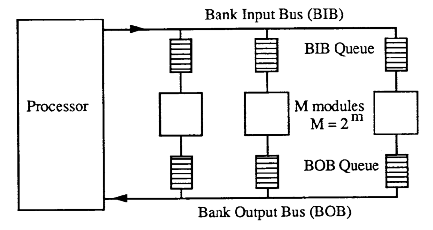
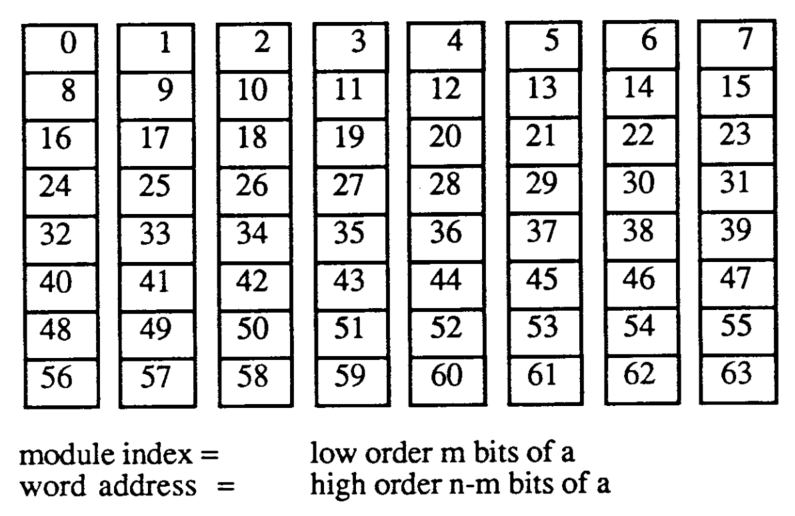
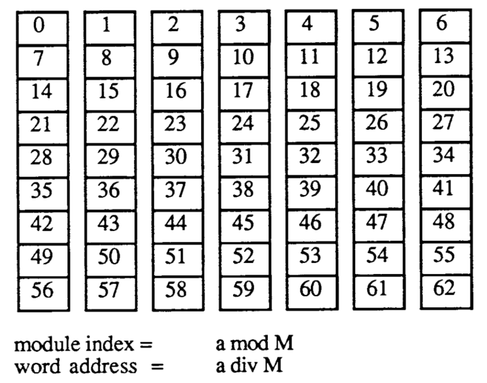
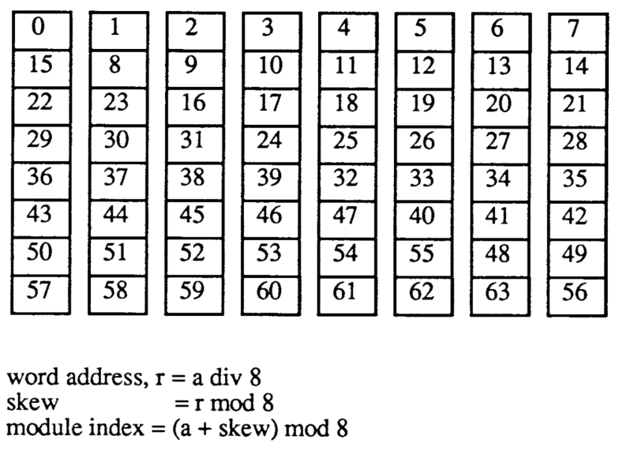
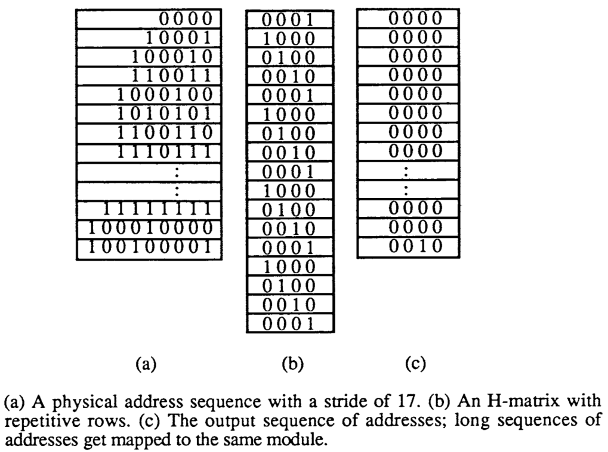
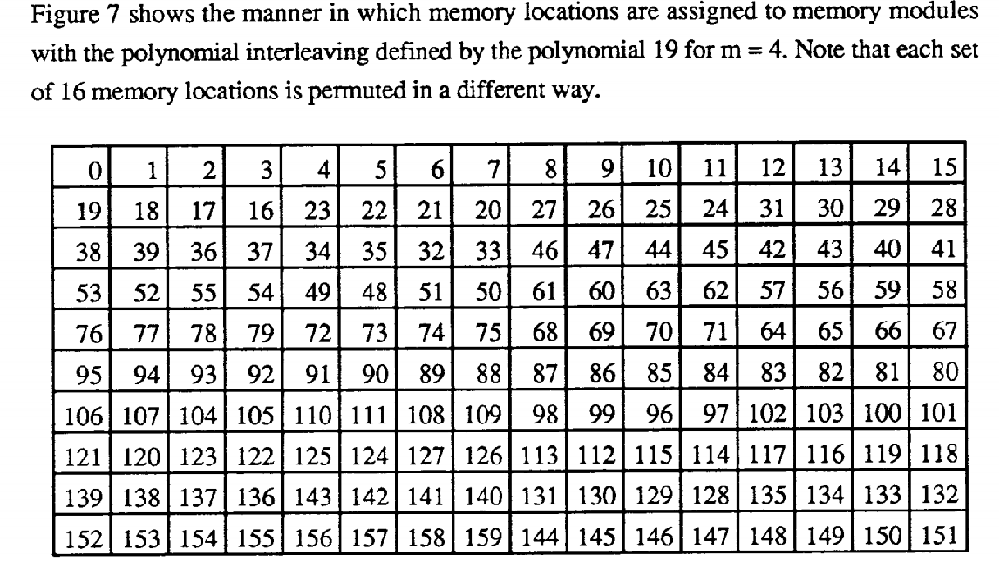

# Pseudo-Randomly Interleaved Memory 

[Pseudo-Randomly-Interleaved-Memory.pdf](./docs/Pseudo-Randomly-Interleaved-Memory.pdf)

## Introduction

Interleaved Memory 交叉存储通常用于提供多个存储instance分摊访问，以实现多处理器并行或高性能单处理器所需带宽的提高。

交叉存储的有效性在于：

- 在一定的交叉存储映射下，访问地址pattern是否具有集聚性
- 当某种pattern下具有集聚性时（如访问集聚在某些bank），交叉存储的性能会迅速下降
- 因此需要设计让交叉存储的映射能够适应更多的pattern

## 常规交叉存储模式

- 处理器内存系统结构

### 顺序交叉存储

- 优点：架构简单
- 缺点：在某些stride情况下，性能会明显下降
  - stride是M(bank数)的倍数时候，地址被映射到同一个bank上

### 质数交叉存储

- 优点：峰值带宽稳定达到，除了stride是M的倍数的时候
- 缺点：计算bankId、offset address等时候会设计除法，计算很复杂

### 偏置存储机制

顺序交叉存储和质数交叉存储问题的关键在于这两种方法一定程度上存在周期性pattern（stride是M的倍数的时候），因此有理由找到对应的访问序列映射在同一个module从而产生集聚，降低带宽。为了解决这一问题，提出了偏置存储机制。虽然这种方法在很大程度上仍然存在集聚现象，如当stride是M*M的倍数的时候，地址会被映射到同一个module bank，但是该方法提出的置换思路可以进一步发展为pseudo-randomly伪随机机制。

- Dorado L2支持的是这一版本

### buffering缓冲

对于M个module（bank），如果能够均匀散列到m个bank，那么就能够获得m/M的总带宽。

## Pseudo-Randomly Interleaving 伪随机交叉存储模式

$$
B=h(A)
$$

其中，A即physical address物理地址，B即randomized address随机映射后的地址：
$$
A=<{a}_{n-1},...,a_m,a_{m-1},...,a_0>	\\
B=<b_{n-1},...,b_m,b_{m-1},...,b_0>
$$
一个较好的伪随机hash函数应具有如下特性：

- 相同的原地址必须映射到相同的随机地址
- 映射应该是一对一的                                                                                                                                                                                                                                                                                                                                                                                                                                                                                                    
- 原地址可以被映射到任意给定的随机地址，避免存储的浪费
- 需要尽量避免局部集聚性
- 当$a_{n-1}$,…$a_m$保持常数的时候，$a_{m-1}$,…, $a_0$遍历$2^m$种组合，$b_{m-1}$,…, $b_0$也应该遍历$2^m$种组合
  - ——>减少集聚（clustering）

- 计算必须简单

> 伪随机函数的关键 {a[n-1:m], a[m-1:0]}  -> b[m-1:0]

一个简单的方法：

1. 对于任何一个 a[n-1:m]，都决定了一个a[m-1:0] -> b[m-1:0]的映射关系

2. 对每个a[n-1:m]，其映射关系是不一样的

### XOR置换

$$
<{a}_{n-1},...,a_0>*
\left[
\begin{matrix}
H(n-1,m-1)	& \cdots	& H(n-1,0) \\
\vdots		& \ddots	& \vdots   \\
H(0,m-1)	& \cdots	& H(0,0)   \\
\end{matrix}
\right]
=<b_{m-1},...,b_0>
$$

其中，$$n≥m$$；一组多输入的异或门，输入为原地址，输出为映射后的地址；

原地址组成一个向量与布尔矩阵相乘，得到映射后的地址bit向量。其中的乘法和和加法是在模2上的计算，分别等价与和异或运算，地址计算简单；

对于布尔矩阵$$H(i,j)=1$$，当且仅当$$a_{m-i-1}$$是XOR门的输入$$h_j$$为输出时；

$$B_H$$由$$A_H$$直接导出而无需变换。

如图所示这种简单的散列，物理地址序列中前16个地址，stride为17，从0开始，地址中1成对出现；H矩阵行以周期4重复，多达16个连续的地址映射到同一个bank，带宽性能下降。

对于M个module（bank），如果能够均匀散列到m个bank，那么就能够获得m/M的总带宽。

## 不可约多项式交叉

### 素数域 - Prime

### GF伽罗华域

$$p(X)=p_0+p_1X+p_2X^2+…+p_{m-1}X^{m-1}+X^m$$

$$A(x)=V(x)*P(x)+R(x)$$

其中，P(x)是m阶多项式，A(x)是与地址a相关联的**n阶多项式**；V(x)和R(x)属于GF(2), R(x)的阶数少于n，则整数r为bank id，v为bank内offset地址。

- 该方法相当于把地址变换过程转换为多项式的计算过程映射过程相当于多项式的分解，商是bank offset地址，余数是bank id；
- 使用系数在伽罗华域GF(2)的多项式，系数只有0和1加减法和异或运算等价，乘法 与运算等价。

### 推导过程

