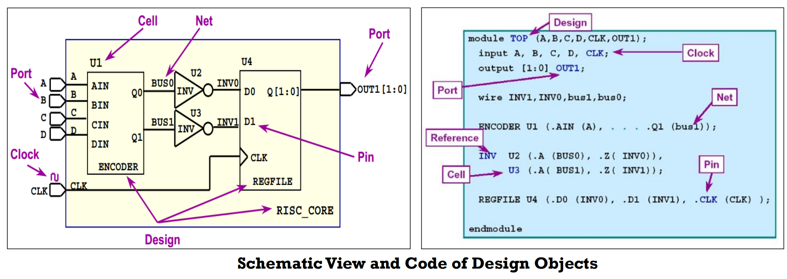

## 1 课程概述

- 数字芯片设计流程


- FPGA设计流程


- Setup Time - The length of time that data must stabilize before the clock transition.


- Hold Time - The length of time that data must remain stable at the input pin after the active clock transition.


> 静态时序分析主要针对同步时序电路，异步时序电路需要单独分析


## 2 Part-1: TCL语言

### 概述


- TCL语言的启动

  - Linux：`#!/user/bin/tclsh`
  - Win：安装active tcl，双击wish.exe

- 置换 ——> TCL解释器运用规则将命令分为一个个独立的单词，并进行必要的置换。

  - 变量置换`$`：TCL解释器会将认为$后面为变量名，将变量置换成它的值。

    ```tcl
    set a "snow"
    puts $a #snow
    puts a  #a
    ```

  - 命令置换`[]`：[]内是一个独立的TCL语句。

    ```tcl
    set a "[expr 3 + 4]"
    puts $a #7
    ```

  - 反斜杆置换`\`：换行符、空格、[、$等被TCL解释器当作特殊符号对待的字符，加上反斜杠后变成普通字符。

    ```tcl
    puts "[expr $X + $Y]"     #2.5
    puts "\[expr $X + $Y\]"   #[expr 1.2 + 1.3]
    puts "\[expr \$X + \$Y\]" #[expr $X + $Y]
    ```

    `\t` -> TAB；
  
    `\n` -> 换行符；
  
    ```tcl
    puts "a\tb"
    # a		b
    puts "a\nb"
    # a
    # b
    ```
  
  - 其他符合：
  
    `""`：TCL解释器对双引号中`$`和`[]`符合会进行变量置换和命令置换。
  
    ```tcl
    puts "\t[expr $X + $Y]"
    # 2.5
    ```
  
    `{}`：花括号中，所有特殊字符都将成为普通字符，TCL解释器不会对其特殊处理。
  
    ```tcl
    puts {\t[expr $X + $Y]}
    # \t[expr $X + $Y]
    ```
  
    `#`：表示注释。

### 变量、数组、列表

- 变量

  定义：`set 变量名 变量值`

  取值：`$变量名`

  ```tcl
  set cell "bufx2"
  # bufx2
  puts $cell
  # bufx2
  set cell "ivtx2"
  # ivtx2
  puts $cell
  # ivtx2
  
  set a 2
  # 2
  puts $a_1
  # can't read "a_1": no such variable
  puts ${a}_1
  # 2_1
  ```

- 数组

  定义：set 数组名(元素名) 值

  取值：$数组名(元素名)

  ```tcl
  set cell_1(ref_name) "bufx2"
  set cell_1(full_name) "top/cell_1"
  set cell_1(pins) "A B C"
  
  puts $cell_1(ref_name)
  # bufx2
  
  array size cell_1
  # 3
  array names cell_1
  # ref_name pins full_name
  # 这里的输出顺序？//TOFIX
  ```

- 列表：标量的有序集合

  定义：`set 列表名 {元素1 元素2 元素3 ......}`

  取值：`$列表名`

  ```tcl
  set ivt_list {ivtx2 ivtx3 ivtx8}
  puts ivt_list
  # ivtx2 ivtx3 ivtx8
  ```

  常用列表操作命令：

  

  ```tcl
  set list1 {bufx1 bufx2 bufx4}
  set list2 {ivtx1 ivtx2 ivtx4}
  concat $list1 $list2
  # bufx1 bufx2 bufx4 ivtx1 ivtx2 ivtx4
  
  llength $list1
  # 3
  llength [concat $list1 $list1]
  # 6
  
  # lindex返回列表中的第n个元素（从0开始计数）
  lindex $list1 1
  # bufx2
  
  # lappend
  set a {1 2 3}
  # 注意读取需要加$，此处不是读取
  lappend a 4
  puts $a
  1 2 3 4
  ```

  ```tcl
  # 如何得到列表list1{a b c d e f}中的最后一个元素
  set list1 {a b c d e f}
  llength $list1
  # 6
  expr [llength $list1] - 1
  # 5
  lindex $list1 [expr [llength $list1] - 1]
  # f
  ```

  ```tcl
  set a {1 2 3}
  set b {4 5}
  lappend a $b
  # 1 2 3 {4 5}
  
  # 如果这里我们想得到4
  lindex [lappend a $b] 3
  # 4 5
  lindex [lindex [lappend a $b] 3] 0
  # 4
  ```

  - `lsort`列表指令将列表按照一定的规则排序
    - 缺省时默认按照ASCII码进行排序
    - `-real` ——> 按照浮点数值大小排序
    - `-unique` ——> 唯一化，删除重复元素

  ```tcl
  set list1 {c d a f b}
  # c d a f b
  lsort $list1
  # a b c d f
  
  set list2 {-2 3.1 5 0}
  # -2 3.1 5 0
  lsort -real $list2
  # -2 0 3.1 5
  
  set list3 {a c c b a d}
  # a c c b a d
  lsort -unique $list3
  # a b c d
  
  # 获取列表list1中最小值
  set list1 {0 1.2 -4 3 5}
  # 0 1.2 -4 3 5
  lsort -real $list1
  # -4 0 1.2 3 5
  lindex [lsort -real $list1] 0
  # -4
  ```

- 运算

  - 数学运算

    ```tcl
    a+b
    a-b
    a*b
    a/b
    ```

  - 逻辑运算

    ```tcl
    a<=b
    a>=b
    a==b
    a!=b
    ```

  - `expr`数学运算表达式，将运算表达式求值

    ```tcl
    expr 6 + 4
    # 10
    expr 6 - 4
    # 2
    
    expr 5/2
    # 2
    expr 5/2.0
    # 2.5
    expr 5.0/2
    # 2.5
    ```


### 控制流

#### if

- 语法格式：

  `if{} ... elseif {} ... else{} ...`

  ```tcl
  if {$a > $b} {
  puts $a
  } else {
  puts $b
  }
  ```

- 注意，上例中脚本语句的**'{'**一定要写在上一行，因为如果不这样，TCL 解释器会认为if命令在换行符处已结束，下一行会被当成新的命令，从而导致错误。

  ```tcl
  # 判断列表list长度
  set list1 {0 1 2 3 4}
  set length [llength $list1]
  # 5
  if {$length > 3} {
  puts "The length of list1 is larger than 3"
  } elseif {$length == 3} {
  puts "The length of list1 is equal to 3"
  } else {
  puts "The length of list1 is less than 3"
  }
  # The length of list1 is larger than 3
  ```

#### foreach

- 语法格式：`foreach 变量 列表 循环主体`

- 功能：从第0个元素开始，每次按顺序取得列表的一个元素，将其赋值给变量，然后执行循环主体一次，直到列表最后一个元素。

  ```tcl
  set list1 {3 2 1}
  foreach i $list1 {
  puts $i
  }
  # 3
  # 2
  # 1
  ```

#### break

- 结束整个循环过程并从循环中跳出

  ```tcl
  set list1 {3 2 1}
  foreach i $list1 {
  if {$i == 2} {
  break
  }
  puts $i
  }
  # 3
  ```

#### continue

- 仅结束本次循环

  ```tcl
  set list1 {3 2 1}
  foreach i $list1 {
  if {$i == 2} {
  continue
  }
  puts $ i
  }
  # 3
  # 2
  ```

#### while

- 如果判断语句成立（返回值非0），就运行脚本，直到不满足判断条件停止循环，此时while命令中断并返回一个空字符串。

  ```tcl
  set i 3
  while {$i > 0} {
  puts $i
  incr i -1; # set i[expr $i -1]
  }
  # 3
  # 2
  # 1
  ```

#### for

- 如果判断语句返回值非0就进入循环，执行循环主体后，再重新初始化参数。然后再次进行判断，直到判断语句返回值为0，循环结束。

  ```tcl
  for {set i 3} {$i > 0} {incr i - 1} {
  puts $i
  }
  # 3
  # 2
  # 1
  ```

### 过程函数

#### proc

- 类似C语言中的函数。即用户自定义的功能，方便多次调用。

  ```tcl
  proc add {a b} {
  set sum [expr $a + $b]
  return $sum
  }
  
  add 3 4
  # 7
  ```

- 全局变量与局部变量

  - 全局变量：在所有过程之外定义的变量。
  - 局部变量：对于在过程中定义的变量，因为它们只能在过程中被访问，并且当过程退出时会被自动删除。
  - 指令global，可以在过程内部引用全部变量

  ```tcl
  set a 1
  proc sample {x} {
  global a
  set a [expr $a + 1]
  return [expr $a + $x]
  }
  
  sample 3
  # 5
  ```

  ```tcl
  set a 1
  proc sample {x} {
  set a [expr $a + 1]
  return [expr $a + $x]
  }
  
  sample 3
  # Can't read "a": no such variable
  ```

### 正则匹配

- 正则表达式是一种特殊的字符串模式，用来取匹配符合规则的字符串。

- \w：匹配一个字母、数字、下划线

- \d：匹配一个数字

  

- 锚位，用来指示字符串当中开头和结尾的位置，使我们能够匹配到正确的字符

  

- 常用的其他字符还有

  - `\s`：空格
  - `.`：任意字符

- 正则匹配指令：`regexp? switches? exp string? matchVar? ?subMatchVar subMatchVar …?`

  - 功能：在字符串中使用正则表达式匹配

  - `switches`

    `-nocase`将字符串中的大写都当成小写看待。

    `exp` 正则表达式

    `string` 用来进行匹配的字符串

    `matchstring`表示用正则表示式匹配的所有字符串

    `sub1`表示正则表达式中的第一个子表达式匹配的字符串

    `sub2`表示正则表达式中的第二个子表达式匹配的字符串

  - 例：匹配字符串“abc456”

    ```tcl
    regexp {\w+\d+} "abc456"
    ```

  - 例：匹配一个以数字开头且以数字结尾的字符串

    ```tcl
    regexp {^\d.*\d$} "1 dfsal 1"
    ```

  - 通过()可以捕获字符串

    ```tcl
    regexp {\s(\d+).*} "Snow is 30 years old" total age
    puts $total
    # 30 years old
    puts $age
    # 30
    ```

    ```tcl
    regexp {^(\w+)\s\w+\s(\d+).*} "Snow is 30 years old" total name age
    puts $total
    # 30 years old
    puts $name
    # Snow
    puts $age
    # 30
    ```


### 文本处理

- `open`：
  - `open 文件 打开方式`
  - (r表示读模式，w表示写模式)
- `gets`：
  - `gets fileId 变量名`
  - gets读fileId标识的文件的下一行，并把该行赋给变量，并返回该行的字符数（文件尾返回-1）
- `close`：
  - `close fileId`

## 3 Synopsys TCL

- refer to：./docs/4-Synopsys TCL语言入门.pdf

- TCL在EDA工具中的扩展与应用

  

- 使用TCL控制EDA工具流程

  

## 4 Overview of Static Timing Analysis

### PrimeTime


### STA概念

- Timing Arc 时序弧


- cell delay 单元延迟

  - Transition delay

    

  - Logic gate delay

    

- net delay 连线延迟

- Setup Time - The length of time that data must stabilize before the clock transition.

  - 此约束强制数据路径相对于时钟路径的**最大**延迟。


- Hold Time - The length of time that data must remain stable at the input pin after the active clock transition.
  - 此约束强制数据路径相对于时钟路径的最小延迟。


- Timing path 时序路径
  - startpoint
    - a **clock pin** of a sequential element，如D触发器的clk pin
    - an **input port** of the design
  - endpoint
    - a **data input pin** of a sequential element，如D触发器的D端pin
    - an **output port** of the design

- Clock Domain 时钟域
  - 全局异步，局部同步
  - DC/PT 一般处理的是同步电路，而无法应对异步电路，因此在异步电路时候需要约束处理


- Operating Condition 操作条件

  - **Process, Voltage and Temperature**(PVT) -> 工艺制程、电压、温度
  - cell delay和net delay必须基于某一PVT条件才能精准分析

  

  - condition的选择取决于标准库单元cell library

## 5 标准单元库

### Synopsys 时序库概述


### 非线性延迟模型

- Timing Model 时序模型
  - 如下图案例，Tf, Output fall delay; Tr, Output rise delay


## 6 STA环境