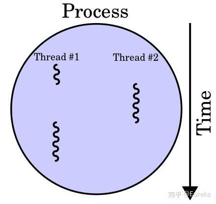

# [线程与进程，并发与并行](https://ruibing.org/science/2016/07/14/Process-Treading.html)

- 程序 -> 进程 -> 线程(thread)
  - 进程是线程在线程在一定时间内的有序集合；除了多个线程，进程还包含被操作系统分配的资源空间，这些资源空间被多个线程所共享。
  - 

- 并发(concurrency)和并行(parallelism)
  - 并发：并不是真正意义上的同时进行，但又是客观存在同时进行两件事
  - 并行：“一心两用”，真正意义上的同时进行

- 线程级并发(thread-level concurrency)
- 进程级并发
  - 单处理器系统(uniprocessor system)
    - 对于CPU而言，这两个进程并不是真正意义上同时进行；而对用户而言，由于快速切换，用户感觉上是同时进行。
- 线程级并行(thread-level parallelism)
  - 多处理器系统(multiprocessor system)
  - 超线程技术(Hyper-Treading, HT)
    - 单物理核心同时两个线程（虚拟内核数？）
  - 多核技术(Multi-Core Processor) -- 物理核心
  - 线程级并行的好处：
    - 运行多任务时，减少了模拟出来的并发；同时进行多任务处理时可以运行更多的并发。
    - 当程序有大量线程可以并行处理时，可以使单个程序运行的更快。

- 指令集并行(instruction-level parallelism)
  - 计算机处理问题是通过指令实现的，每个指令交给CPU执行；当指令间不存在相关时，它们在流水线中是可以重叠起来并行执行。
  - 指令集并行基于流水线(pipeline)技术

- 数据级并行(Multiple-Data parallelism)
  - 单一指令运行多个操作数并行计算
  - SIMD(Single-Instruction Multiple Data)单指令集多数据流技术
    - SIMD指令集可以提供更快的图像，声音，视频数据等运行速度。